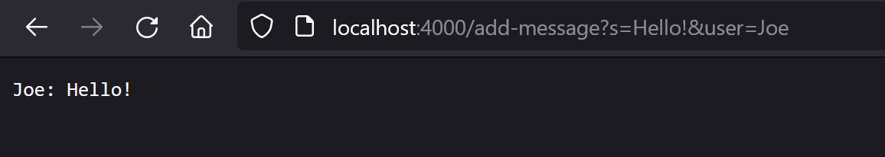
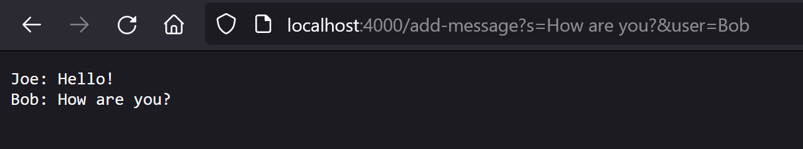
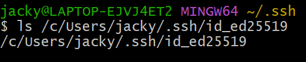
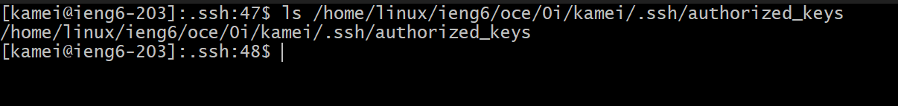
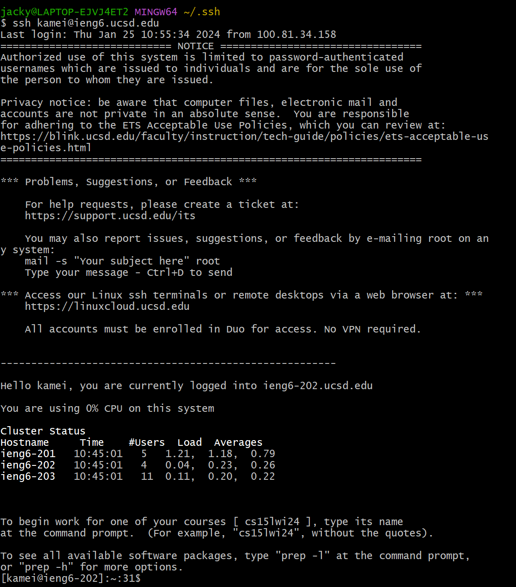

# CSE 15L Lab Report 2
**Part 1**

A web server is created to take queries from incoming requests and format them into a message board.

Code:
```
import java.io.IOException;
import java.net.URI;
import java.util.ArrayList;

class Handler implements URLHandler {

    ArrayList<String> messages = new ArrayList<>();

    public void addMessage(String s, String user) {
        messages.add(String.format("%s: %s", user, s));
    }

    public String showMessages() {
        String allMessages = "";
        for (String message: messages) {
            allMessages += message + "\n";
        }
        return allMessages;
    }

    public String handleRequest(URI url) {
        if (url.getPath().contains("/add-message")) {
            String[] parameters = url.getQuery().split("=");
            String s = parameters[1].split("&user")[0];
            String user = parameters[2];
            addMessage(s, user);
            return showMessages();
        }
        else if (url.getPath().equals("/")) {
            return showMessages();
        }
        else {
            return "404 Not Found!";
        }
    }
}

class ChatServer {
    public static void main(String[] args) throws IOException {
        if(args.length == 0){
            System.out.println("Missing port number! Try any number between 1024 to 49151");
            return;
        }

        int port = Integer.parseInt(args[0]);

        Server.start(port, new Handler());
    }
}
```

The web server accepts paths in the following format:\
``` /add-message?s=<string>&user=<string> ```\
where the string following `s=` represents the message and the string following `user=` represents the user posting the message.

After accepting the request, the web page returns all messages accepted so far.

Here are two examples of the web server in action:


Here, the `handleRequest` method is called with the entire URL as the argument, then the message "Hello!" and user "Joe" are identified from the URL. Then, the `addMessage` method is called using the user "Joe" and the message "Hello!" as arguments to add the formatted message into the list `messages` which contains all stored messages. Finally, the `showMessages` method is called to display all stored messages in one string, which so far only contains the first message. In the entire class, only the `messages` field changed when the string `Joe: Hello!` is added.


Again, the `handleRequest` method is called with the entire URL as the argument, then the message "How are you?" and user "Bob" are identified from the URL. Then, the `addMessage` method is called using the user "Bob" and the message "How are you?" as arguments to add the formatted message into the list `messages`. Finally, the `showMessages` method is called to display all stored messages so far in one string, which now contains the previous message and this message. The `messages` field updated when the string "Bob: How are you?" is added.

---

**Part 2**

SSH keys are generated on the user's machine as a private key and on the remote machine as a public key. This allows logging into remote machines without needing authentication.

Private key path (on my machine):



Public key path (on `ieng6`):



Logging into `ieng6` without needing to provide a password:



---

**Part 3**

In Lab 2, I learned that URLs can be handled using a java file and queries can be taken as inputs. I also learned how to host a web server on my local machine.

In Lab 3, I learned that it is possible to authorize users using ssh to access a remote machine without a password.

