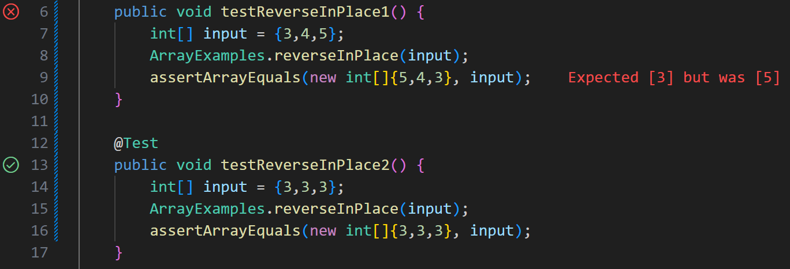

# CSE 15L Lab Report 3

## Part 1

Consider the following buggy method in the `ArrayExamples` class:

```
static void reverseInPlace(int[] arr) {
	for(int i = 0; i < (arr.length) / 2; i += 1) {
		int old = arr[i];
		arr[i] = arr[arr.length - i - 1];
		arr[arr.length - i - 1] = old;
	}
}
```
This method aims to reverse the input array in place, but has a bug that makes it return the wrong values.

We will use JUnit to find a failure-inducing input.

```
@Test
public void testReverseInPlace1() {
	int[] input = {3,4,5};
	ArrayExamples.reverseInPlace(input);
	assertArrayEquals(new int[]{5,4,3}, input);
}

@Test
public void testReverseInPlace2() {
	int[] input = {3,3,3};
	ArrayExamples.reverseInPlace(input);
	assertArrayEquals(new int[]{3,3,3}, input);
}
```
The first test should induce a failure while the second test should pass.

After running these tests using the JUnit testing tool in VS Code:



We can see that the symptom does indeed appear in the first test - the last value of the sorted array should be `3`, but it is `5` instead. So, the array was sorted to `{5, 4, 5}` instead of the expected `{5, 4, 3}`. A symptom does not appear from the second test.

The bug occurs because the reverse method does not take into account the fact that the original values in the first half of the array are overwritten while new values are being copied to it. It can be fixed by iterating over half of the array only and keeping track of the overwritten values, then copying them to the other side of the array.

See the fixed method:

```
static void reverseInPlace(int[] arr) {
	for(int i = 0; i < (arr.length) / 2; i += 1) {
		int old = arr[i];
		arr[i] = arr[arr.length - i - 1];
		arr[arr.length - i - 1] = old;
	}
}
```

***

## Part 2

The `grep` UNIX command is useful for locating specific strings contained in files. Here we will explore some useful command-line options for different use cases.

We will be using the `technical/biomed/` sample directory taken from https://anc.org/data/oanc/download/ to test out the `grep` command.


*Note: all outputs below are truncated to include at most the first 5 lines (using `| head -n 5`) to reduce length.*

***

**`grep -E PATTERN PATH`**

The `-E` option allows searching for strings using an extended regex, which allows more advanced pattern matching.

**Prompt:**
```
grep -E "genetic|cellular" technical/biomed/*.txt
```
**Output:**
```
technical/biomed/1468-6708-3-7.txt:          interstitial fluid volume, and extracellular fluid volume
technical/biomed/1468-6708-3-7.txt:          Other mechanisms for cellular injury have been
technical/biomed/1468-6708-3-7.txt:          antagonists alter cellular repair mechanisms, possibly
technical/biomed/1471-2091-2-10.txt:        [ 24 ] . A genetic screen revealed that CD98 may indirectly
technical/biomed/1471-2091-2-10.txt:          may reside in integrin α chain extracellular or
...
```

Here, a regex statement with the `|` (or) operator is used to match patterns that either contain the "genetic" or "cellular" string.

**Prompt:**
```
$ grep -E "[0-9]" technical/biomed/*.txt
```

**Output:**
```
technical/biomed/1468-6708-3-1.txt:        associated with increased mortality in those over age 65.
technical/biomed/1468-6708-3-1.txt:        for relevant covariates [ 1 2 3 4 5 6 ] . All studies found
technical/biomed/1468-6708-3-1.txt:        in certain small subsets. A review of 13 studies of older
technical/biomed/1468-6708-3-1.txt:        adults drew similar conclusions [ 7 ] .
technical/biomed/1468-6708-3-1.txt:        weight standards be adjusted upwards for age [ 8 ] . Such
...

```

Here, a regex statement with the `[0-9]` class is used to match patterns that contain any number.

Sources used: `man` command, https://developer.mozilla.org/en-US/docs/Web/JavaScript/Guide/Regular_expressions/Cheatsheet

***

**`grep -c PATTERN PATH`**

The `-c` option causes the command to return only the number of occurrence of matched patterns in each file.

**Prompt:**
```
$ grep -c "cellular" technical/biomed/*.txt
```

**Output:**
```
technical/biomed/1468-6708-3-1.txt:0
technical/biomed/1468-6708-3-10.txt:0
technical/biomed/1468-6708-3-3.txt:0
technical/biomed/1468-6708-3-4.txt:0
technical/biomed/1468-6708-3-7.txt:3
...
```

Here, the "cellular" string is counted in each file in the `biomed/` directory.

**Prompt:**
```
$ grep -c "the" technical/911report/*.txt
```
**Output:**
```
technical/911report/chapter-1.txt:313
technical/911report/chapter-10.txt:336
technical/911report/chapter-11.txt:533
technical/911report/chapter-12.txt:804
technical/911report/chapter-13.1.txt:643
...
```

Here, the "the" string is counted in each file in the `911report/` directory.

Sources used: `man` command

***

**`grep -o PATTERN PATH`**

The `-o` option causes grep to only output the matched strings instead of including the surrounding words.

**Prompt:**
```
$ grep -o "cellular" technical/biomed/*.txt
```

**Output:**
```
technical/biomed/1468-6708-3-7.txt:cellular
technical/biomed/1468-6708-3-7.txt:cellular
technical/biomed/1468-6708-3-7.txt:cellular
technical/biomed/1471-2091-2-10.txt:cellular
technical/biomed/1471-2091-2-10.txt:cellular
...
```

Here, the "cellular" strings are located in the `biomed/` directory and only the strings themselves are returned.

**Prompt:**
```
$ grep -o -E "genetic|cellular" technical/biomed/*.txt 
```
**Output:**
```
technical/biomed/1468-6708-3-7.txt:cellular
technical/biomed/1468-6708-3-7.txt:cellular
technical/biomed/1468-6708-3-7.txt:cellular
technical/biomed/1471-2091-2-10.txt:genetic
technical/biomed/1471-2091-2-10.txt:cellular
...
```

Here, the command locates either "genetic" or "cellular" in the `biomed/` directory and only the strings themselves are returned.

Sources used: `man` command
***

**`grep -r PATTERN PATH`**

The `-r` option allows recursive searching of an input directory instead of just files.

**Prompt:**
```
$ grep -r "directory" technical/
```

**Output:**
```
technical/911report/chapter-13.4.txt:                telephone book, he gave them another directory "possibly covering Long Beach,
technical/911report/chapter-7.txt:                listing Hazmi in the telephone directory. They managed to avoid attracting much
technical/biomed/1471-2105-2-9.txt:            sequences are loaded into the program from a directory
technical/biomed/1471-2164-3-4.txt:        preserve the subdirectory structure inside the archive. To
technical/biomed/1471-2164-3-4.txt:        file is located in the root directory named
...
```
Here, the command looks for the "command" string recursively in all subdirectories in the `technical/` directory. Note that the `-r` option allows the input path to be a directory, whereas normally it would throw an error.

**Prompt:**
```
$ grep -r "1234" technical/
```
**Output:**
```
technical/biomed/1471-2172-4-2.txt:          Life Sciences) and read in a 1234 Delfia Fluorometer
technical/biomed/gb-2003-4-2-r9.txt:            (AF251193), a metalloprotease falcilysine, (AF123458),
technical/government/Env_Prot_Agen/tech_adden.txt:Medicine 150: 1234-1242.
```
Here, the command looks for the "1234" string recursively in all subdirectories in the `technical/` directory. 

Sources used: `man` command