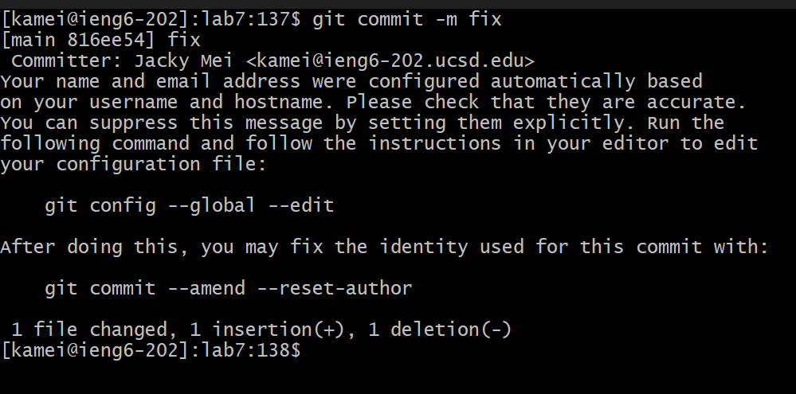

# CSE 15L Lab Report 4

In this lab report we will clone a git repository, find and fix a bug in the code using Vim, then commit and push with as few steps as possible. We will do this on an `ieng` machine.

## Step 1: Log in to `ieng6`

In the terminal, type `ssh kamei@ieng6.ucsd.edu` and press Enter, where `kamei` is the username. If the `ssh` authentication keys are set up beforehand, login credentials will not be needed.

We are now logged in to `ieng6` and can begin our tasks.

## Step 2: Clone the git repository

Go to the repository on Github and copy its SSH path with `<Ctrl+C>`. For this case, the address is `git@github.com:perilune42/lab7.git`.

In the terminal, type `git clone `, paste in the path using `<Ctrl+V>` (or `<Shift+Insert>` if using the Git Bash terminal), then press Enter. The repository will begin to download.

After the clone is finished, change into the `lab7` directory by inputting `cd lab7<Enter>`. We are now ready to access the files in `lab7`.

## Step 3: Run the test

Use the included shell script to run tests for the Java program. Input `bash t<Tab><Enter>`, which autocompletes to `bash test.sh`. The test results show us that there is an error in the `merge` method of `ListExamples`.

## Step 4: Enter Vim to edit the file

Now that we know there is a bug in the `ListExamples.java` file, we can use Vim to edit and fix the file.

Input `vim L<Tab>.<Tab><Enter>`, which autocompletes to `vim ListExamples.java`. We are now in the Vim editor and can begin making changes to the file.

## Step 5: Navigate to the change

Input `Shift + G` to jump to the end of the file. In this view, we can see that `index1` should be changed to `index2`. 

Navigate the cursor to the line by repeatedly pressing `k` or up arrow 6 times. Press `e` to jump to the end of the word. The cursor should now be at the exact position where we want to make the change.

Alternatively, if we assume that we know the line number of the change beforehand (line 44), we can do this faster by inputting from the beginning `44<Shift+G>e`, which jumps the cursor to the correct position immediately.

## Step 6: Edit and save

Input `r2`. This replaces the next character with `2`, which should fix the bug.

To save and exit, input `:wq<Enter>`, which will save all changes and exit Vim. We are now back in the terminal.

## Step 7: Verify the fix

Run the shell script again with the input `<Up Arrow><Up Arrow><Enter>`. This runs the same command to test as we did 2 lines ago.

If everything worked well, we should now see that all tests pass.

## Step 8: Add, commit, and push

Type in the terminal `git add .` and press Enter. This adds the edits we made in the current directory to the next commit.

Type in the terminal `git commit -m <MESSAGE>` and press Enter. The message can be any message related to the changes we made. This commits our changes, and they will be ready to be pushed to git. We can verify our changes were recorded by checking that the output of the command says `1 file changed`.

Finally, type `git push` and press Enter. This pushes our commit to the git repository online. We can check on the Github website that the files have been updated.