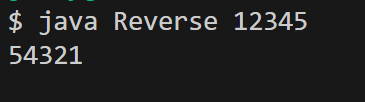
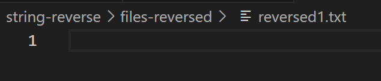

# CSE 15L Lab Report 4

**Part 1**

This is a conversation on Edstem:

---

**Student**: Hello! I have a java program that takes in a string and reverses it, and I want to use a bash script to reverse the content of several files and create new files containing the reversed content. But my new files don't have any content in them, even though my java program works perfectly. 

Running the java program:



My bash script:
```
INDEX=1
rm -f files-reversed/*
for FILE in files/*.txt
do
    cat $FILE | xargs java Reverse > files-reversed/reversed$INDEX.txt
    INDEX=$(($INDEX+1))
done
```

But when I check the files created by the bash script, there is always nothing in them. I think bash is not processing the java output properly. HELP!!!!!



**TA**: Hi, this may be a problem with the output stream of your java program. Can you try running the commands `java Reverse 123 > std.txt` and `java Reverse 123 2> err.txt` to see which output stream java outputs to?

**Student**: Thank you so much!!!! After running the commands, I found the expected `321` in `err.txt` which tells me that my program is printing to the error stream instead of the standard output stream.

***

The directory structure before this conversation was as follows:
```
string-reverse/
- files/
  - string1.txt  (content: "abcde")
  - string2.txt  (content: "12345")
- files-reversed/
  - reversed1.txt  (empty)
  - reversed2.txt  (empty)
- reverse-files.sh
- Reverse.class
- Reverse.java

```

Content of `Reverse.java`: 

```
public class Reverse {
    public static void main(String[] args) {
        if (args.length > 0) {
            String revString = "";
            for (int i = 0; i < args[0].length(); i++) {
                revString += args[0].charAt(args[0].length()-i-1);
            }
            System.err.println(revString);
        } 
    }
}
```

Content of `reverse-files.sh`:

```
INDEX=1
rm -f files-reversed/*
for FILE in files/*.txt
do
    cat $FILE | xargs java Reverse > files-reversed/reversed$INDEX.txt
    INDEX=$(($INDEX+1))
done
```

To trigger the bug: execute the bash script by running `bash reverse-files.sh`. 

To fix the bug: Change `System.err.println(revString);` to `System.out.println(revString);` in `Reverse.java`, changing `err` to `out` and directing the output of java to the standard output stream.

***

**Part 2**

This lab is very cool and I learned a lot. I didn't know how to use Vim before and I didn't know about all the cool features it had, though I still prefer a modern editor any day. I also learned how to write bash scripts and how I can use it to automate some simple tasks and manipulate files, which is pretty handy. Overall very cool, would recommend (even though 15L will be gone :(  ).